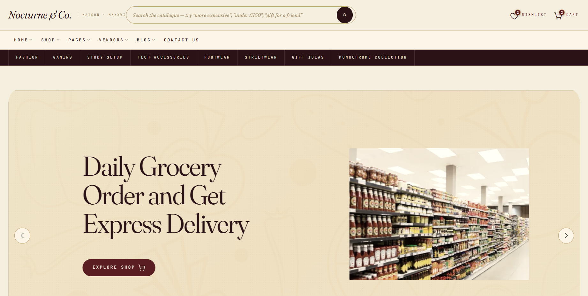
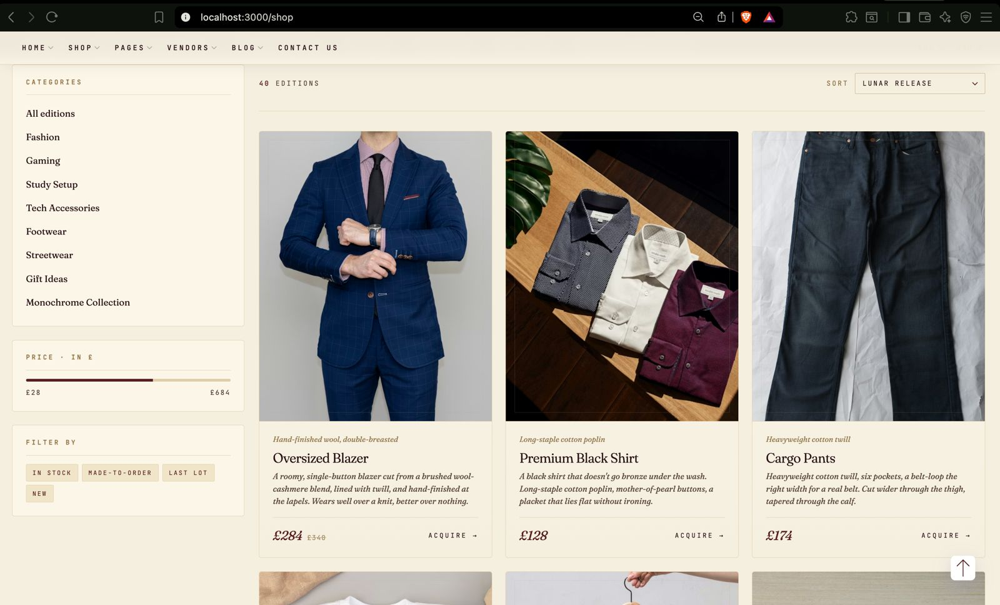

# Nocturne & Co. — A Valkey-powered Storefront

A small, curated e-commerce build for the Build Beyond Limits hackathon hosted by React Hyderabad and powered by Valkey. The storefront fronts a fictional maison called "Nocturne & Co." — eight categories, forty hand-edited products, and a single overriding goal: prove that Valkey can carry the full read path of a real shop, from catalogue browsing to natural-language search.

The repository ships three things working together:

- A React + Bootstrap frontend, restyled to the Nocturne aesthetic
- A Node.js Express service that talks to Valkey for every catalogue lookup
- A small agentic layer that turns plain English queries into structured product filters and runs them through Valkey indexes

There is no demo data file the frontend reads from. Categories, products, similar-product recommendations, search suggestions, popularity rankings, and recent searches all come from Valkey.

---

## Screenshots

Catalogue browse:



Natural-language search results:



---

## What is inside

```
insomniacs/
  backend/                       # Node + Express + ioredis service
    src/
      agent/                     # NLU, planner, explainer, Gemini bridge
      data/                      # Catalogue source of truth (40 SKUs, 8 categories)
      routes/                    # /api/products, /api/categories, /api/agent/*
      scripts/                   # seed.js and reseed:images
      services/                  # catalog, cache, conversation, image,
                                 # search-suggest, trending, preference
      tools/                     # search_products, semantic_search, similar
      valkey/                    # ioredis client and key helpers
  frontend/                      # React app (CRA, React Router 6, Bootstrap 5)
    src/
      components/                # Headers, footer, cards, common/ProductImage
      lib/                       # api.js (single fetch wrapper), img helpers
      pages/                     # CategoryPage, ProductPage, SearchResultsPage
      styles/nocturne.css        # The Nocturne brand layer
  documentation/                 # Hackathon brief and assets
```

The frontend's hardcoded `data/products.js` is kept only as a fallback shape reference. Every visible page reads from the API now.

---

## How Valkey is used

The catalogue exists nowhere on disk apart from the seed file. Everything else is derived:

| Concern | Valkey structure | Key |
| --- | --- | --- |
| Product document | JSON (or fallback to plain SET when the JSON module is absent) | `product:<id>` |
| Category membership | SET | `category:<slug>` |
| Brand membership | SET | `brand:<slug>` |
| Price range queries | ZSET, score = price | `products:price`, `products:price:<slug>` |
| Rating range queries | ZSET, score = rating | `products:rating`, `products:rating:<slug>` |
| Live stock | HASH | `index:stock` |
| Low-stock watchlist | SET | `index:stock:low` |
| Conversation memory (per session) | JSON, 30-minute TTL | `conversation:<sessionId>` |
| Tool result cache | STRING with EXPIRE, 5-minute TTL | `agent_cache:<sha1-of-args>` |
| Catalogue query cache | STRING with EXPIRE | `api_cache:<sha1>` |
| Trending counters | ZSET, ZINCRBY on view | `trending:global:1h`, `trending:category:<slug>:1h` |
| Image URL cache | STRING, 7-day TTL | `image_cache:<productId>` |
| Search popularity | ZSET, ZINCRBY on every query | `search:popular` |
| Recent searches | LIST, LPUSH + LTRIM 10, 30-day TTL | `search:recent:<sessionId>` |
| Suggestion vocabulary | SET, refreshed hourly | `search:terms` |
| Embeddings (toy 8-dim) | HASH | `index:embeddings` |
| User preferences | JSON, 30-day TTL | `user_preferences:<userId>` |

The server checks the product index count against the data file count on every boot. If they disagree it wipes the indexes, re-seeds, and clears every tool and API cache. That means a hot edit to `data/products.js` is reflected on the next restart with no manual step.

---

## How the natural-language search works

The path for a query like `gift for a friend who reads at night, under £100`:

1. The agent routes for `/api/agent/search` look up the session's conversation memory and append the new turn.
2. A rule-based NLU pass produces an initial parse: intent, categories, tags, themes, price range, recipient, age. A Gemini call runs in parallel; if it returns a usable JSON it is merged on top of the rule-based result. If it fails for any reason the rule-based result is the source of truth.
3. The planner decides which tools to run. Refine intents skip semantic recall (the toy embedding axes only confuse them). Theme-driven queries strip theme keywords from the free-text so the qToken filter does not reject every product that happens not to contain the literal word "sports".
4. `search_products` calls `catalog.queryProducts`, which narrows candidates through Valkey indexes before hydrating the small remainder set in memory. `semantic_search` does an 8-dim cosine over the embedding hash if the query lights up any axis.
5. Results from each tool are fused on product id, sorted by combined score, and the top six are explained by the explainer. A `notInCatalog` flag is set when nothing survives; the frontend renders an honest "not in our catalogue" message with a list of real categories the user can pivot to.

The catalogue is fictional, so the algorithm is graded on whether it refuses cleanly on out-of-scope queries (`refrigerator`, `cars`) and recovers on the in-scope ones (`sports` → footwear and gaming gear, `more expensive` → top-priced six, `under £150` → the affordable end).

---

## Prerequisites

- Node.js 18 or later
- Docker (to run Valkey locally)
- A Gemini API key is optional. The rule-based NLU is fully self-sufficient; Gemini is a polish layer.

---

## Running the project

Three processes need to be up: Valkey, the backend, the frontend. They are deliberately decoupled so you can restart any one of them without disturbing the others.

### 1. Start Valkey

```
docker run -d --name valkey -p 6379:6379 valkey/valkey-bundle:9-alpine
```

The bundle image ships every module the project might use (JSON, Search, Time Series). The code degrades gracefully when a module is missing — for example, JSON.SET falls back to plain SET with a JSON-serialised payload.

### 2. Backend

```
cd backend
cp .env.example .env       # then edit if you have a Gemini key
npm install
npm start
```

The server listens on port 4000. On first boot it seeds the catalogue into Valkey and resolves every product's hero image. Health check:

```
curl http://localhost:4000/health
```

To force a full re-seed (after editing `backend/src/data/products.js`):

```
docker exec valkey valkey-cli FLUSHDB
npm start                       # the auto-seed step picks up the new count
```

To re-resolve product imagery without touching the catalogue:

```
npm run reseed:images
```

### 3. Frontend

```
cd frontend
npm install
npm start
```

The dev server runs on port 3000 and proxies API calls to `http://localhost:4000`. If you prefer a different backend URL, set `REACT_APP_CATALOG_URL` and `REACT_APP_API_URL` in a `.env.local`.

---

## API surface (short version)

| Method | Path | Purpose |
| --- | --- | --- |
| GET | `/health` | Liveness + Valkey + module + Gemini detection |
| GET | `/api/categories` | All categories |
| GET | `/api/products` | Filtered catalogue (category, brand, price range, tags, sort, pagination) |
| GET | `/api/products/:id` | Single product by id or short slug |
| GET | `/api/products/:id/similar` | Tag- and brand-weighted neighbours |
| GET | `/api/products/:id/image` | Resolved hero image payload from the image cache |
| GET | `/api/products/trending` | Trending ZSET top-N |
| POST | `/api/agent/search` | Natural-language search; returns explained results plus a `notInCatalog` flag |
| GET | `/api/agent/suggestions?q=&sessionId=` | Search-bar suggestions: prefix matches + popular + recent |
| GET | `/api/agent/popular` | Top-K most searched queries |

---

## Useful commands

| Command | What it does |
| --- | --- |
| `cd backend && npm start` | Run the API on :4000 |
| `cd backend && npm run seed` | Wipe and re-seed Valkey from `data/products.js` |
| `cd backend && npm run reseed:images` | Re-resolve every product's hero image |
| `cd frontend && npm start` | Run the React dev server on :3000 |
| `cd frontend && npm run build` | Produce a production bundle |
| `docker exec -it valkey valkey-cli` | Drop into the Valkey CLI |
| `docker exec valkey valkey-cli FLUSHDB` | Clear all keys in the active database |

---

## Notes and trade-offs

- Image hosting is on `loremflickr.com` with a Picsum fallback. Resolved URLs are cached in Valkey for seven days. The bulk seed sometimes rate-limits loremflickr; running `npm run reseed:images` again later fills in the gaps because each retry replaces a Picsum entry.
- The 8-dimensional embedding (`science / electronics / kids / educational / audio / fashion / home / premium`) is intentionally small and lexical. It is enough to catch obvious semantic intent (gifts, audio, premium) without pretending to be a real vector model. Refine intents skip it for that reason.
- The `data/products.js` file in the frontend is preserved for reference but no rendered page depends on it. CategoryPage, ProductPage, CategoriesPage, and SearchResultsPage all read from the backend.
- The "New" badges that used to flicker above the Pages and Vendors menu items have been removed; the inline header search input now serves the same affordance and is always editable.

---

## License

Open source, hackathon use.
